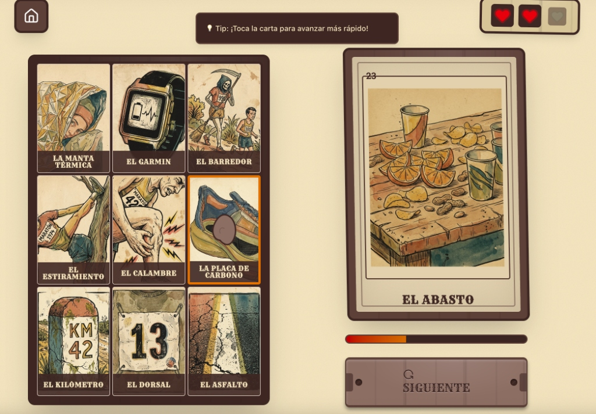

# Tempo Lottery 🏃‍♂️🏃‍♀️

Un juego de lotería mexicana temática para corredores (Road & Trail), construido con Next.js y generado con IA (Gemini).

## Estructura del Proyecto

- `app/`: Aplicación Web Next.js (el juego).
- `gen-assets/`: Scripts de Python para generar la baraja y las imágenes con IA.
    - `generate_deck.py`: Script principal.
    - `output/`: (Ignorado en git) Donde se generan los assets crudos.

## Demo

[https://tempo-lottery-622959071640.us-central1.run.app/](https://tempo-lottery-622959071640.us-central1.run.app/)

## Cómo Jugar

1.  Entra a la URL.
2.  Empieza el juego.
3.  ¡Corre! Tienes tiempo limitado para identificar las cartas.

---
Proyecto creado como experimento de "Tempo - Road & Trail".
